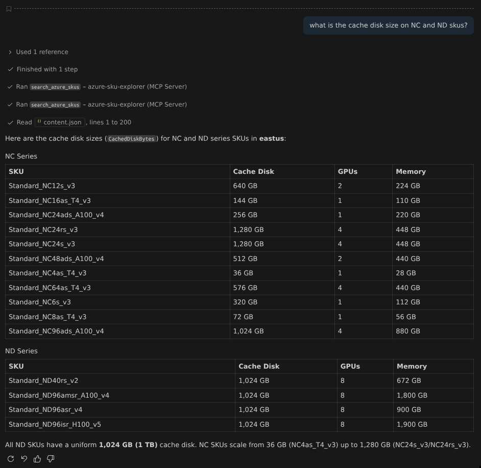

# Azure SKU Explorer MCP Server

A [Model Context Protocol (MCP)](https://modelcontextprotocol.io/) server that exposes Azure Compute SKU information as a tool for AI assistants. Built with [FastMCP](https://gofastmcp.com/).

## What it does

Provides a single tool — `search_azure_skus` — that queries the Azure Resource SKUs API and returns VM sizes, capabilities (vCPUs, memory, GPUs, accelerated networking, etc.), and restriction info for any Azure region. Results can be filtered by a search string.

## Prerequisites

- Python 3.10+
- An Azure subscription with credentials configured (Azure CLI, managed identity, environment variables, etc.)

## Setup

```bash
# Clone the repo
git clone <repo-url>
cd azure-sku-mcp

# Create and activate a virtual environment
python3 -m venv .venv
source .venv/bin/activate

# Install dependencies
pip install fastmcp azure-identity azure-mgmt-subscription azure-mgmt-compute
```

## Authenticate to Azure

The server uses `DefaultAzureCredential`, which tries credentials in this order:

1. Environment variables (`AZURE_CLIENT_ID`, `AZURE_TENANT_ID`, `AZURE_CLIENT_SECRET`)
2. Workload identity
3. Managed identity
4. Azure CLI (`az login`)
5. Azure Developer CLI (`azd auth login`)

The simplest way for local development:

```bash
az login
```

## Running the server

```bash
# Stdio transport (default — used by MCP clients like GitHub Copilot)
python server.py
```

## Testing

Verify the server loads and the tool is registered:

```bash
source .venv/bin/activate

python -c "
import asyncio
from server import mcp

async def main():
    tools = await mcp.list_tools()
    for t in tools:
        print(f'Tool: {t.name}')
    print('Server OK')

asyncio.run(main())
"
```

Test the tool with a live Azure query (requires `az login`):

```bash
python -c "
import asyncio, json
from server import mcp

async def main():
    result = await mcp.call_tool('search_azure_skus', {
        'location': 'eastus',
        'filter_str': 'Standard_NC'
    })
    # result.content contains TextContent with JSON
    for item in result.content:
        data = json.loads(item.text)
        for sku in data[:3]:
            print(f\"{sku['name']:30s} vCPUs={sku['capabilities'].get('vCPUs','?'):>3s}  Mem={sku['capabilities'].get('MemoryGB','?'):>5s} GB\")
        print(f'... {len(data)} SKUs matched')

asyncio.run(main())
"
```

Expected output (example):

```
Standard_NC12s_v3              vCPUs= 12  Mem=  224 GB
Standard_NC16as_T4_v3          vCPUs= 16  Mem=  110 GB
Standard_NC24ads_A100_v4       vCPUs= 24  Mem=  220 GB
... 13 SKUs matched
```

## Adding to GitHub Copilot (VS Code)

1. Open VS Code settings JSON (`Ctrl+Shift+P` → "Preferences: Open User Settings (JSON)")

2. Add the server to `mcp.servers`:

```jsonc
{
    "mcp": {
        "servers": {
            "azure-sku-explorer": {
                "command": "/absolute/path/to/azure-sku-mcp/.venv/bin/python",
                "args": ["/absolute/path/to/azure-sku-mcp/server.py"],
                "env": {}
            }
        }
    }
}
```

Replace `/absolute/path/to/` with the actual path (e.g., `/home/paul/Microsoft/`).

3. Reload VS Code (`Ctrl+Shift+P` → "Developer: Reload Window")

4. In Copilot Chat (Agent mode), ask something like:

> What GPU VM sizes are available in eastus2? Show me their vCPU and memory specs.

Copilot will invoke the `search_azure_skus` tool automatically.

### Example: cache disk sizes on NC and ND SKUs

In Copilot Chat (Agent mode), we asked:

> What is the cache disk size on NC and ND SKUs?

Copilot automatically:

1. **Made two parallel tool calls** — one with `filter_str="Standard_NC"` and another with `filter_str="Standard_ND"` — to query both SKU families in a single turn.
2. **Extracted the `CachedDiskBytes` capability** from each SKU result and converted it from bytes to human-readable GB.
3. **Presented the results as tables**, grouped by series.

This demonstrates how an MCP tool returns raw JSON data and the AI handles all the formatting and analysis — you ask a natural-language question and get a structured answer.



## Project structure

```
azure-sku-mcp/
├── server.py          # MCP server with search_azure_skus tool
├── requirements.txt   # Pinned dependencies
└── README.md          # This file
```

## License

MIT
